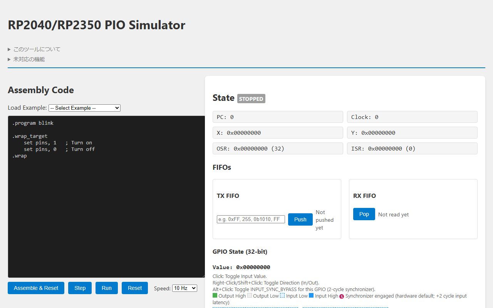

# PIO Simulator

A browser-based PIO (Programmable I/O) assembly simulator for the Raspberry Pi Pico (RP2040) and Pico 2 (RP2350).

## Features

- **No Installation Required:** Write and simulate PIO assembly code completely within your web browser.
- **RP2040 & RP2350 Support:** Compatible with both the original Pico and the new Pico 2 architectures.
- **Real-time Visualization:** 
  - Step-by-step execution debugging
  - Scratch registers (X, Y) and Shift registers (ISR, OSR) states
  - TX / RX FIFO buffers
  - GPIO pin states and timing charts
- **Interrupts (IRQ) Monitoring:** Clickable IRQ flags to test wait and set behaviors interactively.

## Usage

You can use the live version hosted here:
**[Launch PIO Simulator](https://ice458.github.io/tools/pio_sim/)**

1. Paste or write your PIO assembly code in the editor on the left.
2. Use the control buttons (Run, Step, Reset) to execute the code.
3. Monitor the changes in state machines, FIFOs, and timing diagrams on the right.

## License

This project is licensed under the MIT License - see the [LICENSE](LICENSE) file for details.
